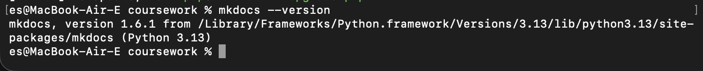
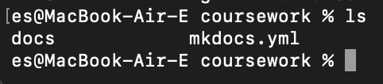
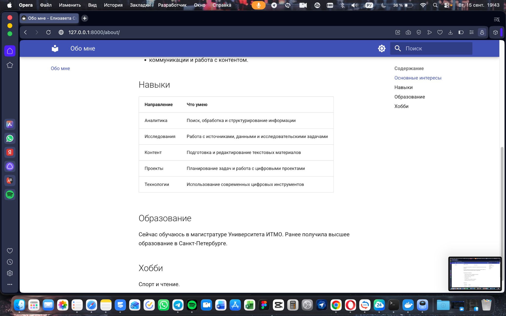
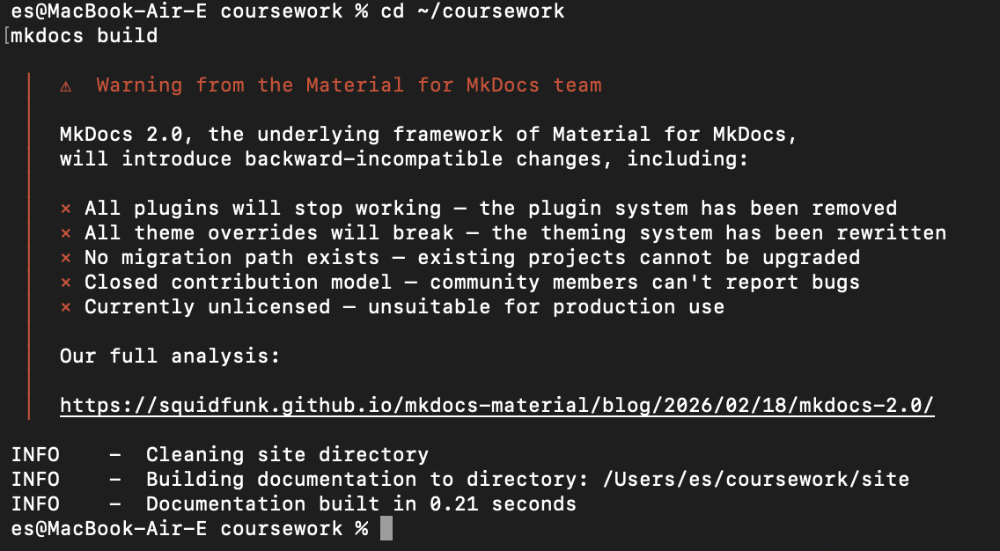
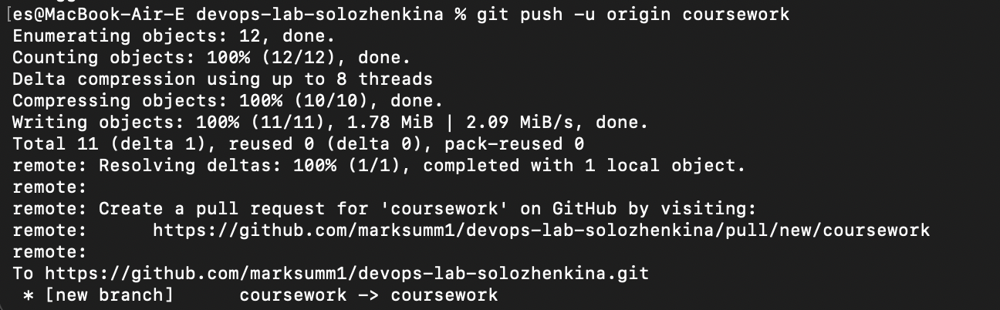
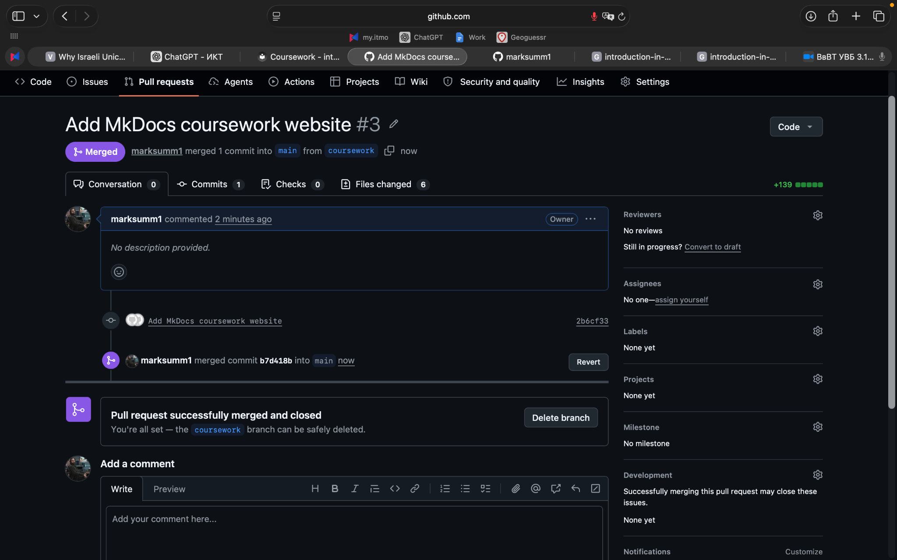
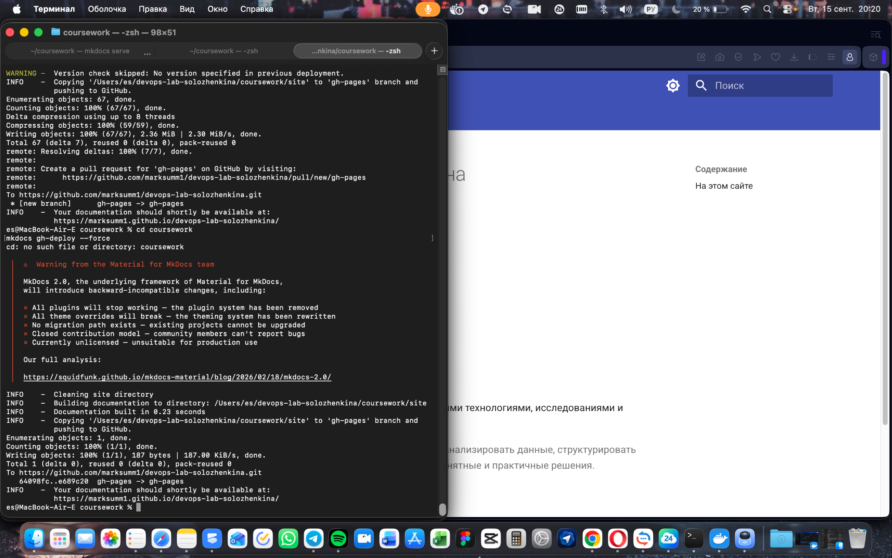

# Курсовая работа

## «Создание персонального сайта с использованием MkDocs»

**Университет:** Университет ИТМО  
**Курс:** Введение в веб-технологии  
**Группа:** U4225  
**Автор:** Соложенкина Елизавета  
**Дата выполнения:** 15.09.2026  

---

## Цель работы

Создать персональный сайт с использованием генератора статических сайтов MkDocs, языка разметки Markdown и темы Material for MkDocs, настроить навигацию, поиск и визуальное оформление, проверить сайт локально и опубликовать его с помощью GitHub Pages.

## Используемые технологии

- Python 3;
- MkDocs;
- Material for MkDocs;
- Markdown;
- Git и GitHub;
- GitHub Pages.

---

## Ход работы

### 1. Установка и проверка MkDocs

Для работы был установлен MkDocs и тема Material. Корректность установки была проверена командой:

```bash
mkdocs --version
```

В результате была получена версия MkDocs 1.6.1.



### 2. Создание проекта

Была создана отдельная папка `coursework`, после чего проект инициализирован командой:

```bash
mkdocs new .
```

После инициализации были созданы основные элементы проекта: каталог `docs` и файл конфигурации `mkdocs.yml`.



### 3. Настройка конфигурации

В файле `mkdocs.yml` были настроены:

- название и описание сайта;
- автор сайта;
- тема Material;
- русская локализация;
- светлая и тёмная цветовые схемы;
- навигация по страницам;
- поиск;
- подсветка результатов поиска;
- кнопка возврата к началу страницы;
- URL опубликованного сайта.

Структура навигации включает четыре обязательных раздела:

1. Главная;
2. Обо мне;
3. Проекты;
4. Контакты.

### 4. Создание контента

Для сайта были созданы Markdown-файлы:

```text
docs/
├── index.md
├── about.md
├── projects.md
├── contacts.md
└── images/
    └── avatar.png
```

На страницах использованы различные элементы Markdown: заголовки, маркированные и нумерованные списки, ссылки, изображение, цитата, таблица и выделение текста.

На главной странице размещены краткое описание и аватар. Страница «Обо мне» содержит информацию об интересах, навыках, образовании и хобби. На странице «Проекты» представлены исследовательские, цифровые и учебные IT-проекты. В разделе «Контакты» добавлена ссылка на GitHub.

### 5. Локальное тестирование

Для локального запуска использовалась команда:

```bash
mkdocs serve
```

Сайт был доступен по адресу `http://127.0.0.1:8000/`. Были проверены навигация, отображение изображения, переходы между страницами и поиск.


На странице «Обо мне» была использована таблица для структурирования навыков.



### 6. Сборка сайта

Статическая версия сайта была создана командой:

```bash
mkdocs build
```

Сборка завершилась успешно, после чего MkDocs сформировал содержимое каталога `site`.



### 7. Загрузка проекта в GitHub

Согласно правилам репозитория изменения выполнялись в отдельной ветке `coursework`. После проверки файлов был создан коммит и ветка отправлена в удалённый репозиторий командой:

```bash
git push -u origin coursework
```



После этого был создан Pull Request из ветки `coursework` в `main`. Конфликтов при слиянии не возникло, Pull Request был успешно объединён с основной веткой.



### 8. Публикация через GitHub Pages

Для публикации сайта использовалась команда:

```bash
mkdocs gh-deploy --force
```

MkDocs сформировал ветку `gh-pages` и отправил в неё собранную версию сайта.



Опубликованный сайт доступен по адресу:

**https://marksumm1.github.io/devops-lab-solozhenkina/**


---

## Результат

В ходе работы был создан и опубликован персональный сайт на MkDocs, соответствующий требованиям курсовой работы:

- сайт содержит 4 страницы;
- используется тема Material;
- настроена навигация между страницами;
- используются разные элементы Markdown;
- добавлено изображение;
- настроен поиск;
- добавлена таблица;
- настроены светлая и тёмная темы;
- сайт успешно собирается командой `mkdocs build`;
- сайт опубликован в интернете через GitHub Pages.

## Вывод

В результате выполнения курсовой работы были освоены основные возможности MkDocs и Markdown, настройка темы Material, структура статического сайта, локальное тестирование, сборка проекта, работа с Git-ветками и Pull Request, а также публикация статического сайта с использованием GitHub Pages.
