# Лабораторная работа №1
## Основы работы с Docker

**Университет:** Университет ИТМО  
**Факультет:** ФТМИ  
**Курс:** Введение в веб-технологии  
**Учебный год:** 2026/2027  
**Группа:** U4225  
**Автор:** Соложенкина Елизавета  
**Дата создания:** 04.09.2026  
**Дата защиты:** —  

## Цель работы

Научиться работать с Docker: устанавливать Docker, использовать готовые образы, запускать и управлять контейнерами, а также работать с томами.

## 1. Установка Docker и базовые команды

После установки Docker Desktop была проверена версия Docker:

```bash
docker --version
```

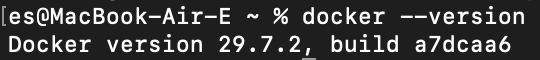

Для проверки корректности установки был запущен тестовый контейнер:

```bash
docker run hello-world
```

В результате было получено сообщение `Hello from Docker!`, подтверждающее корректную работу Docker.

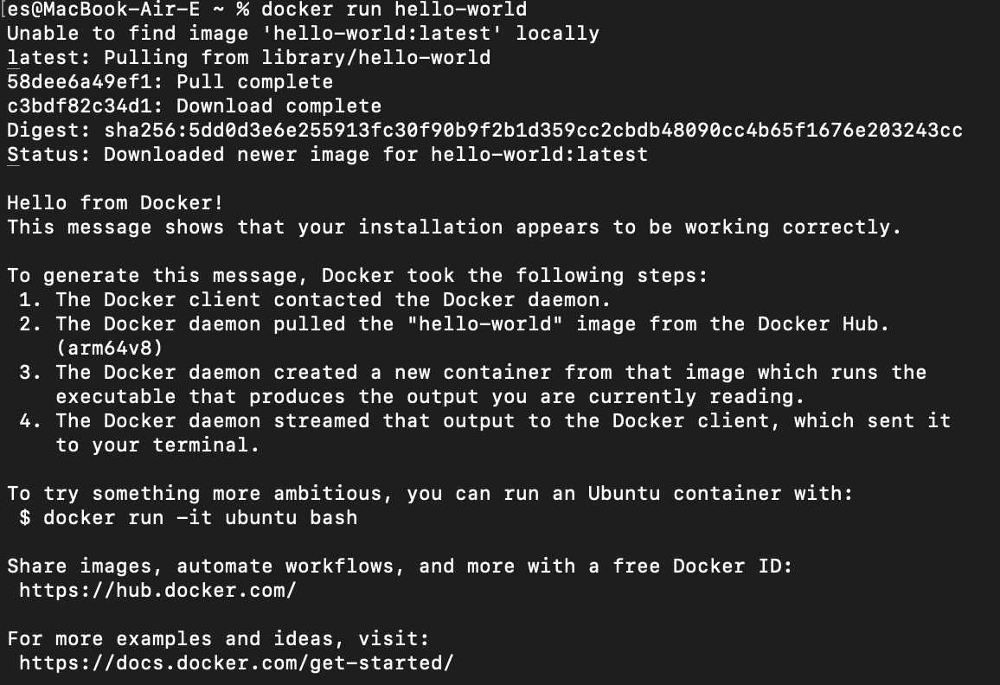

Далее были изучены основные команды Docker:

```bash
docker images
docker ps
docker ps -a
```

Команда `docker images` отображает локально доступные образы, `docker ps` — запущенные контейнеры, а `docker ps -a` — все контейнеры, включая остановленные.

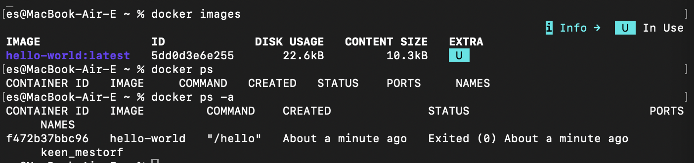

## 2. Работа с готовыми образами

Был загружен образ Ubuntu:

```bash
docker pull ubuntu:latest
```

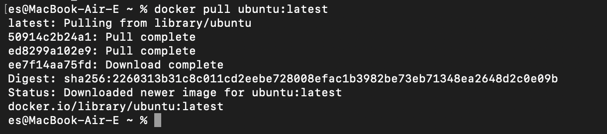

После этого был запущен интерактивный контейнер Ubuntu:

```bash
docker run -it ubuntu bash
```

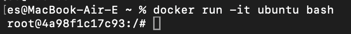

Внутри контейнера был установлен пакет `curl`:

```bash
apt update && apt install -y curl
```

После установки была проверена версия пакета:

```bash
curl --version
```

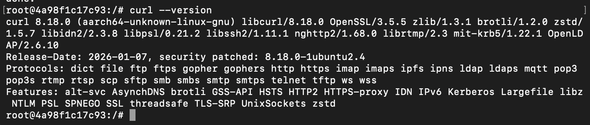

После завершения работы выход из контейнера был выполнен командой:

```bash
exit
```

## 3. Запуск веб-сервера nginx

Был запущен контейнер с веб-сервером nginx:

```bash
docker run -d -p 8080:80 --name web-server nginx:alpine
```

Работа контейнера была проверена командой:

```bash
docker ps
```

Контейнер `web-server` находился в состоянии `Up`, а порт `8080` хоста был связан с портом `80` контейнера.

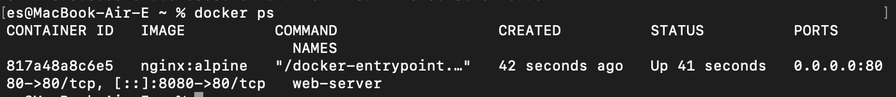

Для проверки работы веб-сервера в браузере был открыт адрес:

```text
http://localhost:8080
```

Отобразилась стандартная страница nginx, что подтвердило успешный запуск веб-сервера.

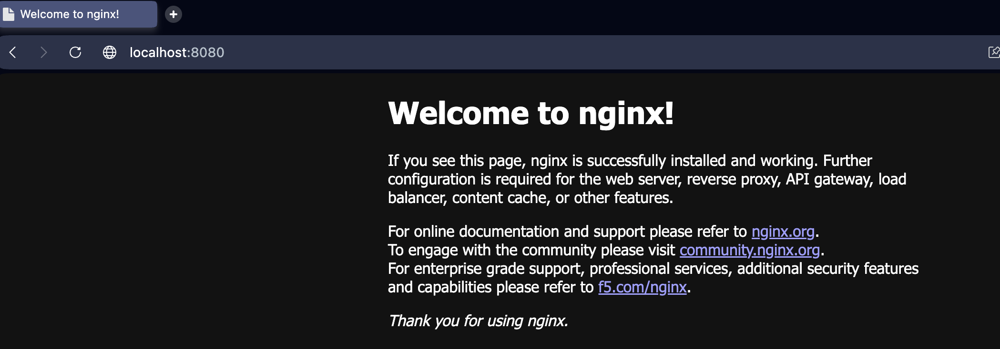

Логи контейнера были просмотрены командой:

```bash
docker logs web-server
```

В логах присутствовал HTTP-запрос `GET / HTTP/1.1` с кодом ответа `200`, что подтверждает успешную обработку запроса веб-сервером.

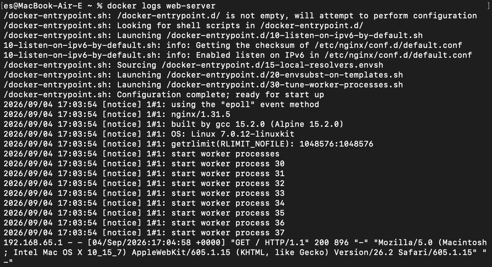

Для подключения к работающему контейнеру была использована команда:

```bash
docker exec -it web-server sh
```

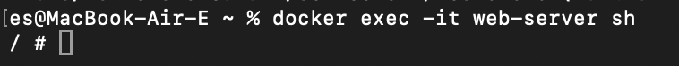

После проверки был выполнен выход из контейнера:

```bash
exit
```

## 4. Управление контейнерами

Для управления контейнером `web-server` были использованы команды:

```bash
docker stop web-server
docker start web-server
docker ps
docker stop web-server
docker rm web-server
```

Контейнер был остановлен, повторно запущен, после чего снова остановлен и удалён.

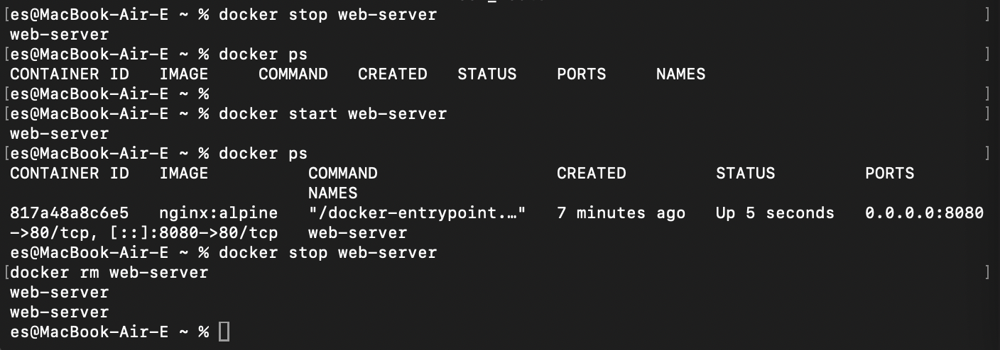

После удаления контейнера был удалён образ nginx:

```bash
docker rmi nginx:alpine
```

Для проверки был повторно выведен список локальных образов:

```bash
docker images
```

Образ `nginx:alpine` отсутствовал в списке, что подтвердило его успешное удаление.

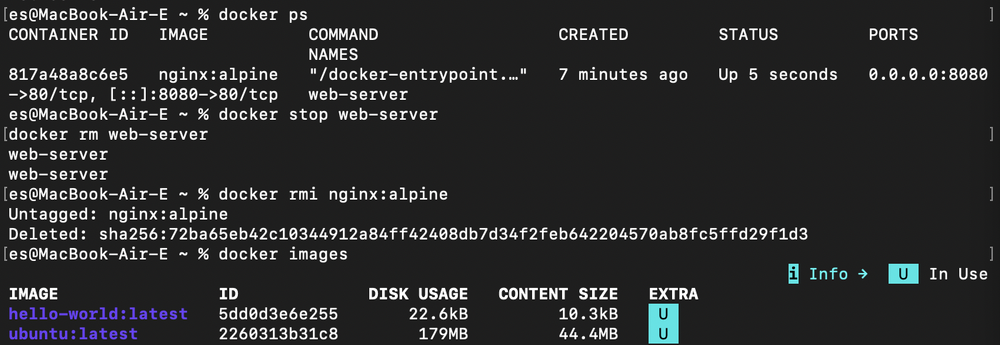

## 5. Работа с томами

Был создан Docker volume:

```bash
docker volume create my-volume
```

Список существующих томов был проверен командой:

```bash
docker volume ls
```

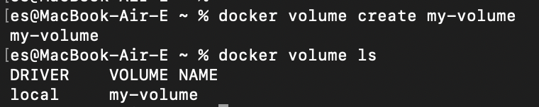

После этого был запущен контейнер с подключением созданного тома:

```bash
docker run -it --name volume-test -d -v my-volume:/data ubuntu bash
```

Для подключения к контейнеру была выполнена команда:

```bash
docker exec -it volume-test bash
```

Внутри контейнера в подключённом томе был создан файл:

```bash
echo "Hello from volume" > /data/test.txt
```

После этого контейнер был остановлен и удалён:

```bash
docker stop volume-test
docker rm volume-test
```

Был создан новый контейнер с подключением того же тома:

```bash
docker run -it --name volume-test-2 -d -v my-volume:/data ubuntu bash
```

К новому контейнеру было выполнено подключение:

```bash
docker exec -it volume-test-2 bash
```

Содержимое ранее созданного файла было проверено командой:

```bash
cat /data/test.txt
```

В результате была получена строка:

```text
Hello from volume
```

Несмотря на удаление первого контейнера, файл сохранился. Это подтверждает, что данные Docker volume хранятся независимо от жизненного цикла контейнера.

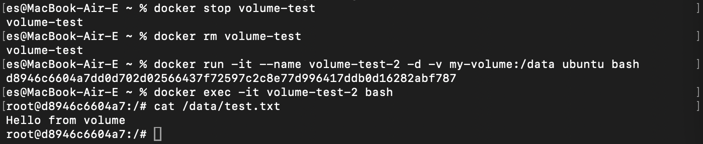

## Вывод

В ходе лабораторной работы был установлен и настроен Docker, изучены основные команды для работы с образами и контейнерами. Были запущены контейнеры Ubuntu и nginx, выполнено управление их состоянием и удаление образов. Также была изучена работа Docker volumes и подтверждено сохранение данных после удаления контейнера.
