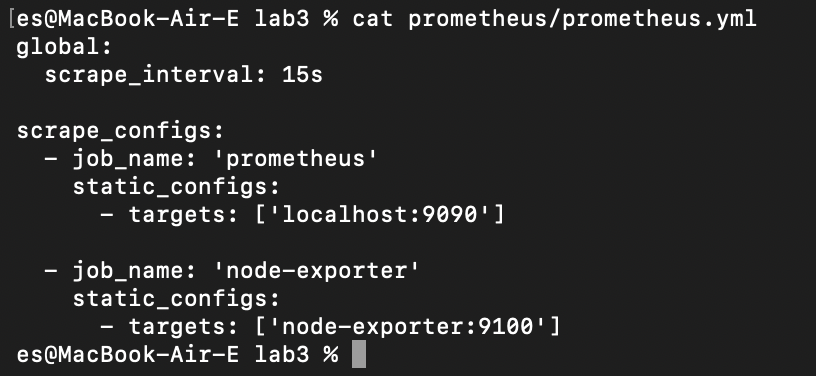
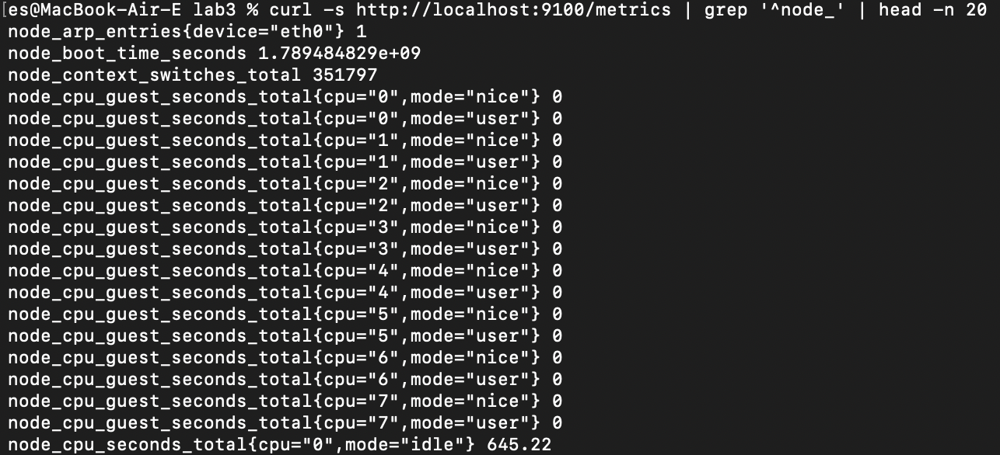
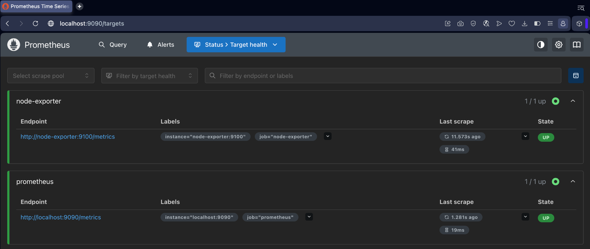
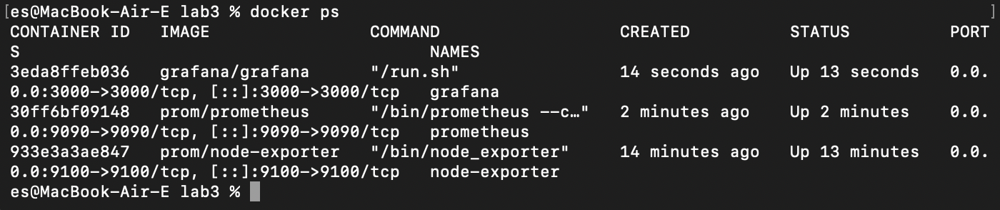
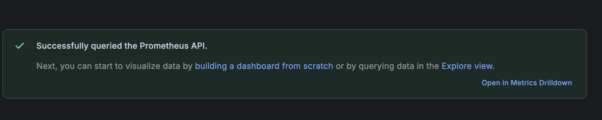
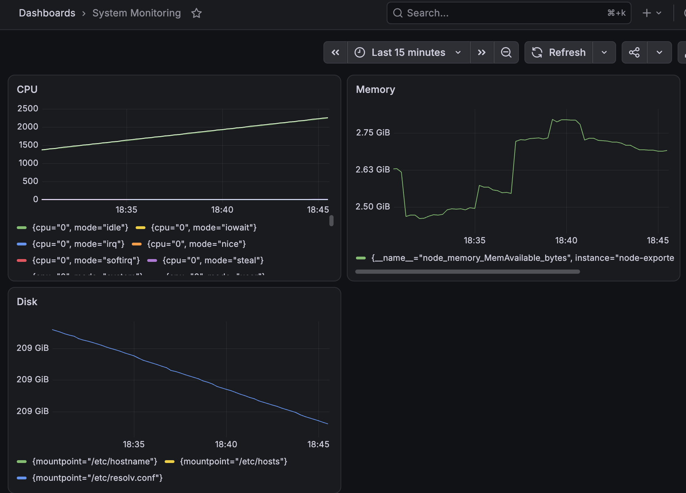

University: [ITMO University](https://itmo.ru/ru/)  
Faculty: [FICT](https://fict.itmo.ru)  
Course: [Введение в веб технологии](https://itmo-ict-faculty.github.io/introduction-in-web-tech/)  
Year: 2025/2026  
Group: U4225  
Author: Solozhenkina Elizaveta  
Lab: Lab3  
Date of create: 15.09.2026  
Date of finished: —  

# Лабораторная работа №3. Мониторинг с Prometheus и Grafana

## Цель работы

Настроить локальную систему мониторинга с использованием Prometheus для сбора метрик, Node Exporter для получения системных метрик и Grafana для их визуализации.

## Ход работы

### 1. Создание конфигурации Prometheus

Для конфигурации Prometheus была создана папка `prometheus` и файл `prometheus/prometheus.yml`.

```yaml
global:
  scrape_interval: 15s

scrape_configs:
  - job_name: 'prometheus'
    static_configs:
      - targets: ['localhost:9090']

  - job_name: 'node-exporter'
    static_configs:
      - targets: ['node-exporter:9100']
```

Конфигурация задаёт интервал сбора метрик 15 секунд и два источника данных: сам Prometheus и Node Exporter.



### 2. Запуск Node Exporter

Так как работа выполнялась на macOS через Docker Desktop, Linux-специфичные bind mount'ы `/proc`, `/sys` и `/` из примера методических указаний не использовались. Node Exporter был запущен в контейнере и подключён к общей сети `monitoring`, чтобы Prometheus мог обращаться к нему по имени контейнера.

```bash
docker network create monitoring

docker run -d \
  --name node-exporter \
  --network monitoring \
  --restart=unless-stopped \
  -p 9100:9100 \
  prom/node-exporter
```

Работа Node Exporter была проверена получением метрик через HTTP:

```bash
curl -s http://localhost:9100/metrics | grep '^node_' | head -n 20
```



### 3. Запуск Prometheus

Для хранения данных Prometheus был создан Docker volume:

```bash
docker volume create prometheus-data
```

Контейнер Prometheus был запущен в сети `monitoring` с подключением созданной конфигурации:

```bash
docker run -d \
  --name prometheus \
  --network monitoring \
  --restart=unless-stopped \
  -p 9090:9090 \
  -v prometheus-data:/prometheus \
  -v "$PWD/prometheus:/etc/prometheus" \
  prom/prometheus \
  --config.file=/etc/prometheus/prometheus.yml \
  --storage.tsdb.path=/prometheus \
  --storage.tsdb.retention.time=200h \
  --web.enable-lifecycle
```

В интерфейсе Prometheus на странице `http://localhost:9090/targets` оба источника — `prometheus` и `node-exporter` — имеют состояние `UP`.



### 4. Запуск Grafana

Для данных Grafana был создан отдельный volume:

```bash
docker volume create grafana-data
```

Grafana была запущена в той же сети `monitoring`:

```bash
docker run -d \
  --name grafana \
  --network monitoring \
  --restart=unless-stopped \
  -p 3000:3000 \
  -v grafana-data:/var/lib/grafana \
  -e "GF_SECURITY_ADMIN_PASSWORD=admin" \
  grafana/grafana
```

Команда `docker ps` показала одновременную работу трёх контейнеров: Grafana, Prometheus и Node Exporter.



### 5. Подключение Prometheus к Grafana

В Grafana был добавлен источник данных Prometheus. В качестве адреса сервера указан адрес контейнера внутри общей Docker-сети:

```text
http://prometheus:9090
```

Проверка подключения завершилась успешно: Grafana смогла выполнить запрос к Prometheus API.



### 6. Создание дашборда мониторинга

В Grafana был создан дашборд `System Monitoring` с тремя панелями:

- **CPU** — метрика `node_cpu_seconds_total`;
- **Memory** — метрика `node_memory_MemAvailable_bytes`;
- **Disk** — метрика `node_filesystem_avail_bytes`.

Для памяти и диска единицы отображения были настроены в формате `Bytes (IEC)`, поэтому значения представлены в GiB. Для наглядного отображения собранных за время лабораторной данных выбран диапазон `Last 15 minutes`.



## Результат

В ходе лабораторной работы была настроена локальная система мониторинга из трёх компонентов:

1. Node Exporter собирает системные метрики.
2. Prometheus опрашивает Node Exporter и хранит временные ряды.
3. Grafana получает данные из Prometheus и визуализирует их на дашборде.

Работоспособность системы подтверждена состоянием `UP` для targets в Prometheus, успешным подключением источника данных в Grafana и отображением графиков CPU, памяти и дискового пространства.

## Вывод

В результате работы были изучены базовые принципы мониторинга и взаимодействия Prometheus, Node Exporter и Grafana в Docker-среде. Настроены сбор системных метрик, их хранение и визуализация на едином дашборде.
